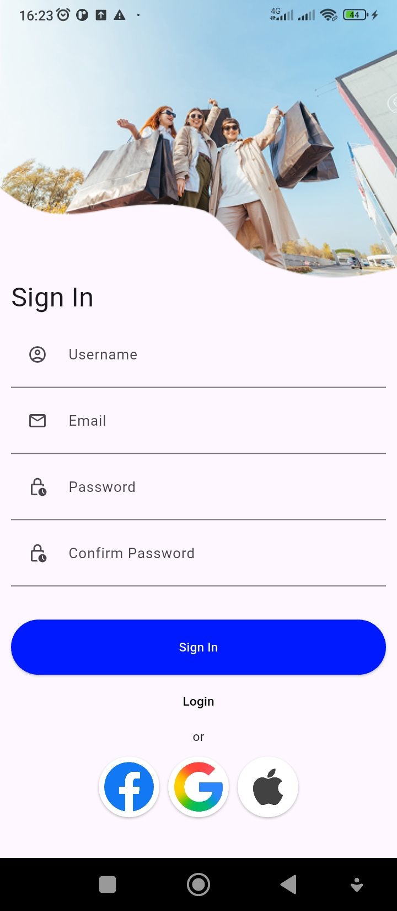
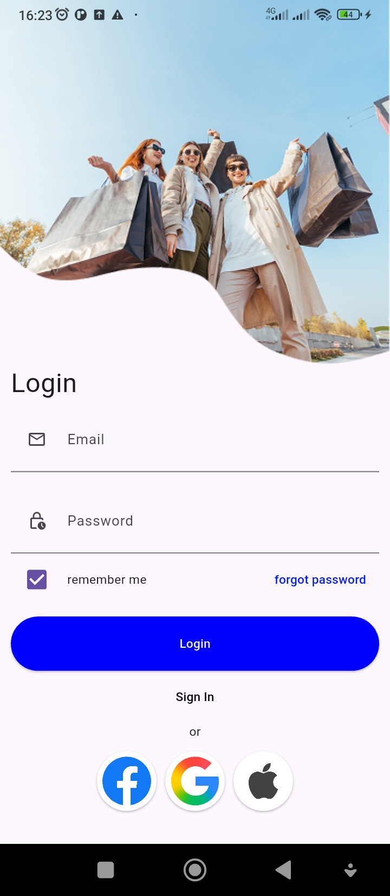

## 🛒 BeliAja — Ecommerce Sederhana

Aplikasi ecommerce sederhana dengan frontend Flutter dan backend Express.js.
Saat ini fitur yang sudah selesai adalah Register dan Login dengan autentikasi token.

## 🖼️ UI Preview

<p float="left">
  
  
</p>


### ✅ Fitur yang Sudah Selesai

- ✅ Register User
- ✅ Login User
- ✅ Validasi input
- ✅ Error handling (email duplikat, kredensial salah)
- ✅ Menyimpan token (SharedPreferences)
- ✅ Integrasi Flutter ↔ Express

## 🛠️ Teknologi yang Digunakan
### 📌 Frontend (Flutter)

- Flutter SDK
- Dio (HTTP Client)
- Provider / State Management
- SharedPreferences
- Form Validation

### 📌 Backend (Express.js)

- Node.js + Express
- Middleware Error Handling
- JWT Authentication
- Body Parser / JSON
- Sequelize(mysql)


## 📂 Struktur Proyek

### 📱 Flutter (Frontend)
``` 
lib/
 ├─ data/
 │   ├─ models/
 │   ├─ source/
 │   │  ├─ local/
 │   │  ├─ remote/
 ├─ presentation/
 │   ├─ navigation/
 │   ├─ pages/
 │   ├─ providers/
 ├─ services/
 ├─ main.dart
 ├─ pubspec.yaml
```

### 🖥️ Express (Backend)
```
backend/
 ├─ app/
 │   ├─ controllers/
 │   ├─ services/
 │   ├─ models/
 │   ├─ routes/
 ├─ models/
 ├─ config/
 │   └─ config.js
 ├─ routes/
 ├─ index.js
 ├─ package.json
```

## ▶️ Cara Menjalankan Backend
```bash
cd backend
npm install
npm run migrate 
npm run dev
```
### Contoh .env
- pastikan DB_NAME tersedia
```bash
DB_HOST=localhost
DB_PORT=3306
DB_NAME=name_database
DB_PASSWORD=
DB_USERNAME=root
DIALECT=mysql
SECRET_JWT=your_secret
```
## ▶️ Cara Menjalankan Flutter
```bash
cd frontend
flutter pub get
flutter run
```

## ✅ Status Saat Ini

- ✔ Register selesai
- ✔ Login selesai
- ✔ Error handling selesai
- ❌ Belum ada fitur produk
- ❌ Belum ada UI dashboard ecommerce
- ✅ Sudah siap dikembangkan lebih lanjut

## 🚀 Next Feature (Opsional)

- Produk & kategori
- Keranjang belanja
- Checkout
- Profile user
- Admin panel
